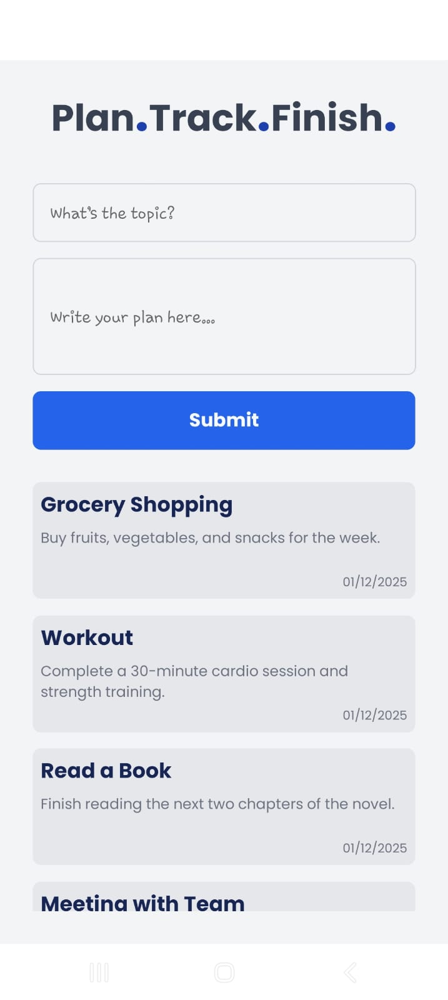
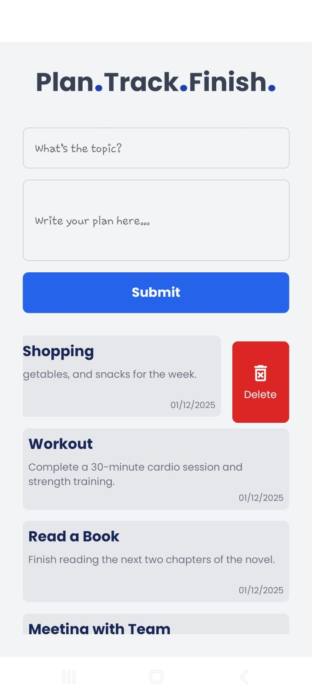
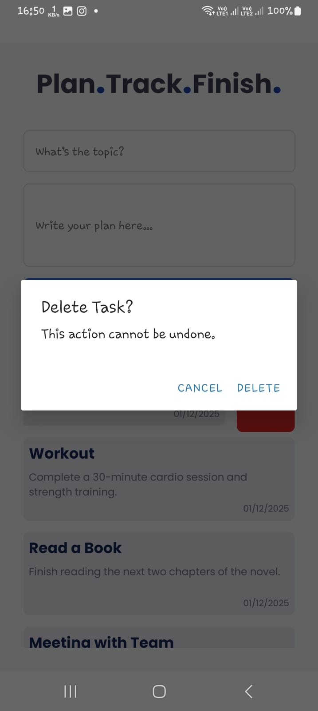

---

# 🌟 **Plan.Track.Finish. — Task Management App**

A minimal, elegant, and fast task management app built with **React Native**, **Expo**, and **NativeWind (Tailwind CSS)**.
Designed with simplicity, clarity, and productivity in mind.

---

## 🚀 **Features**

* ✨ **Add tasks** with topic & description
* 🗑️ **Swipe to delete** with confirmation
* 📱 **Responsive UI**, works on all screen sizes
* 🎨 **Tailwind-powered styling** via NativeWind
* ⚡ **Smooth swipe gestures** using Gesture Handler
* 📝 **Beautiful empty state screen**
* 🔤 **Custom Poppins font** integration
* 💡 Simple, clean, beginner-friendly UX

---

## 📸 **Screenshots**

### 🧾 Main Screen (Tasks List)

<p align="center">
  
</p>
<p align="center"><i>Task list with swipe-to-delete functionality.</i></p>

---

### 📭 Empty State Screen

<p align="center">
  
</p>
<p align="center"><i>A clean, friendly prompt when no tasks exist.</i></p>

---

### 🗑️ Delete Action (Swipe)

<p align="center">
  
</p>
<p align="center"><i>Swipe left to reveal the delete button.</i></p>

---

### ❗ Delete Confirmation Dialog

<p align="center">
  
</p>
<p align="center"><i>Confirmation dialog to prevent accidental deletions.</i></p>

---

## 🛠 **Tech Stack**

* ⚛️ **React Native** — Mobile UI framework
* 📱 **Expo** — Development platform
* 🟦 **TypeScript** — Strong typing
* 🎨 **NativeWind** — Tailwind styling
* 🖋 **Poppins Fonts** — Modern typography
* 🤝 **Gesture Handler** — Swipe interactions

---

## 📥 **Installation**

Clone the repository:

```bash
git clone https://github.com/hello-sahasraka/To-Do-App-ReactNative.git
cd react_native_practice
```

Install dependencies:

```bash
npm install
```

Start the Expo development server:

```bash
npx expo start
```

Run the app on:

* ▶️ **Android** — press `a`
* 🍏 **iOS** — press `i`
* 📱 **Expo Go** — scan the QR code

---

## 📁 **Project Structure**

```
react_native_practice/
├── app/
│   └── index.tsx          # Main screen (task list + inputs)
├── components/
│   └── taskCard.tsx       # Swipeable TaskCard component
├── docs/                  # Screenshots for README
├── global.css             # Global Tailwind settings
└── README.md              # Project documentation
```

---

## 🧑‍💻 **Usage**

1. Enter a **task topic**
2. Type a **task description**
3. Tap **Submit**
4. Your task appears in the **scrollable list**
5. Swipe left → tap **Delete**
6. Confirm deletion in the dialog
7. Enjoy your clean, organized task list ✨

---

## 🧩 **Components**

### 🗂 **TaskCard**

Displays an individual task with:

* 🔵 **Topic** (title)
* ✏️ **Description**
* 🗑️ **Swipe-to-delete** action
* 🕒 **Local timestamp**

---

## 🔧 **State Management**

Powered by React Hooks:

* `useState`

  * Manage tasks
  * Store input topic & description
  * Handle simple CRUD operations

Lightweight, fast, and ideal for small to medium apps.

